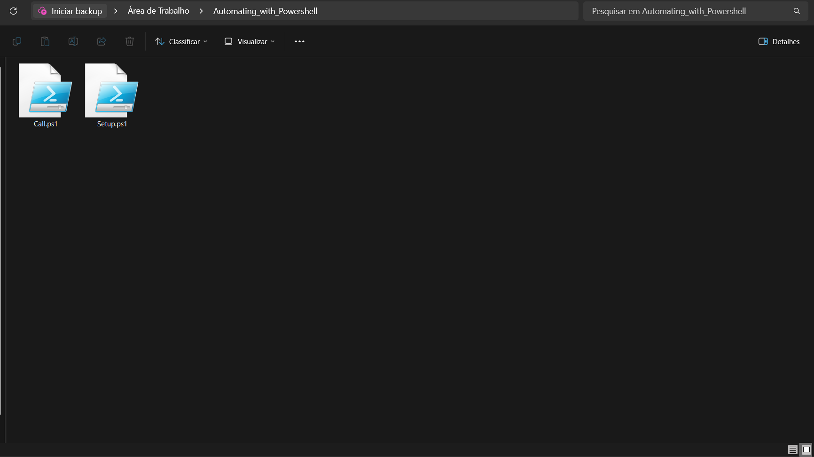
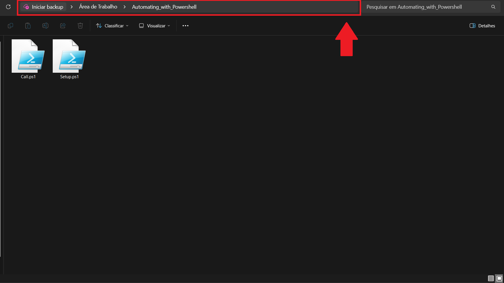
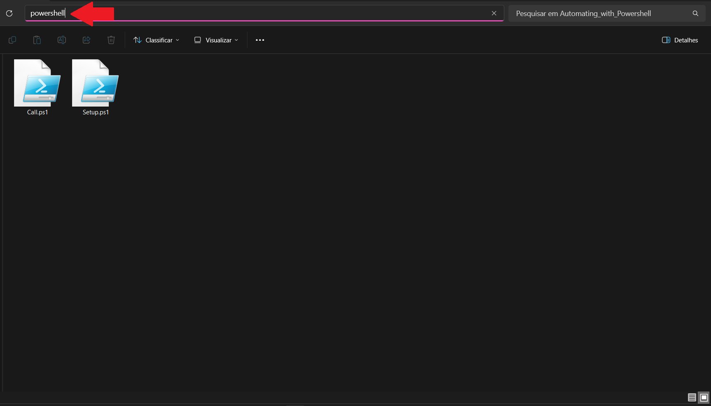
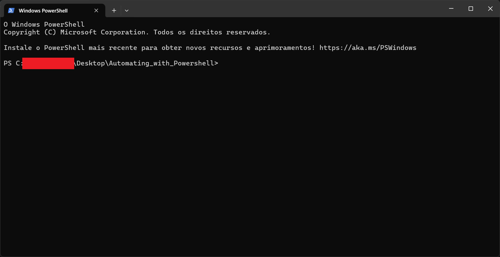
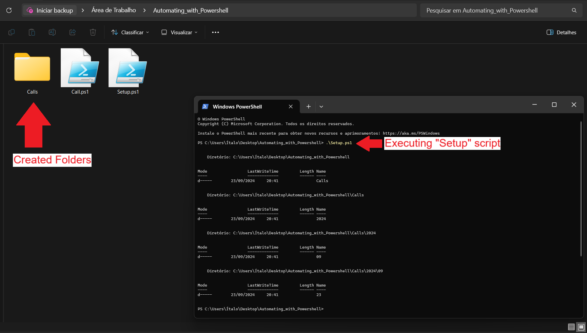
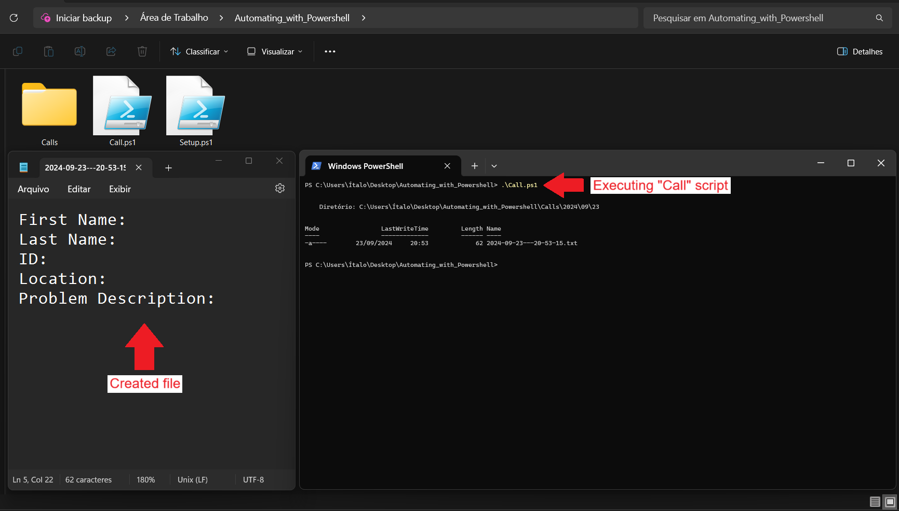

# Automating with PowerShell  

The goal of this project is to automate the process of information collection for a team in Operation Center.  

The project consists of two scripts written in PowerShell (v5.1) which creates a series of folders, subfolders and files
in order to provide an organized way of storing day-to-day client information.  

The scripts can be executed anywhere in your system, and they don't require administrative privileges to run.  

---  

## How to use it  

First, you need to download the scripts by clicking in their following names:  

- [Setup.ps1][1]
- [Call.ps1][2]

### Preparing your environment.  

As previously mentioned, the scripts can be executed from anywhere in your system. However, it is advisable to move them
to a specific folder or to your Desktop. For this demonstration, a folder within the Desktop area was created and it's
going to be used to store and run the scripts.  

1. Move the files to your desired folder.  

[][image1]

2. Click on the search bar, at the top.

[][image2]

3. Clean the selected text and type: `powershell`. Press `Enter`.

[][image3]

This action will start a PowerShell command line in the folder you have your scripts stored.  

[][image4]

### Running the scripts  

*This example assumes you haven't altered the names of the files. If you have changed the file names, use the
correspondent files according to the new spellings assigned by you.*  

The scripts have to be executed in a specific order at first. So, follow the instructions to guarantee an issueless
execution.  

1. The first script to be executed will be the "Setup". For that, you can copy the following line or just type
`.\Setup.ps1` in your already opened PowerShell.  

````powershell
.\Setup.ps1
````

When executed, you should see some files created within your folder.  

[][image5]  

2. Now, in order to have the desired result, you can run the next script by typing `.\Call.ps1` or copying and paste the
following line to PowerShell.  

````powershell
.\Call.ps1
````

When the "Call" script it's executed, a Notepad will pop up containing a default template with basic information to be
gathered.  

[][image6]

From now on, the "Call" script can be executed multiple times. A new file will be created each time for each new
execution of the script. The files are stored within the root of the "Calls" directory.  

The file will create a new folder for each day of the calendar, a new folder for each month and a new folder for each
year without having to alter anything manually. Those changes are created just by executing the "Call" script.  

---  

[1]: https://github.com/ItaloHugoMDS/Automating_with_PowerShell/blob/main/Setup.ps1
[2]: https://github.com/ItaloHugoMDS/Automating_with_PowerShell/blob/main/Call.ps1
[image1]: https://github.com/ItaloHugoMDS/Automating_with_PowerShell/blob/main/images/1_Moving_Files_to_Folder.png
[image2]: https://github.com/ItaloHugoMDS/Automating_with_PowerShell/blob/main/images/2_Search_Bar.png
[image3]: https://github.com/ItaloHugoMDS/Automating_with_PowerShell/blob/main/images/3_Starting_PowerShell.png
[image4]: https://github.com/ItaloHugoMDS/Automating_with_PowerShell/blob/main/images/4_Opened_PowerShell.png
[image5]: https://github.com/ItaloHugoMDS/Automating_with_PowerShell/blob/main/images/5_Executing_Setup_Script.png
[image6]: https://github.com/ItaloHugoMDS/Automating_with_PowerShell/blob/main/images/6_Executing_Call_Script.png
